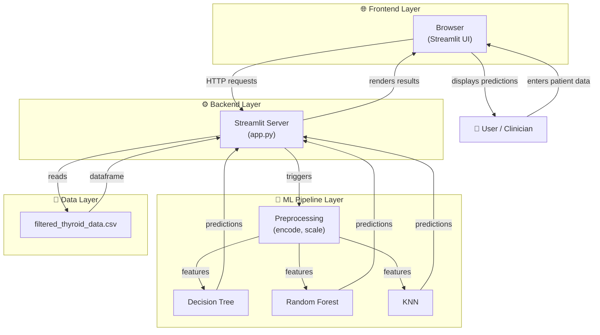
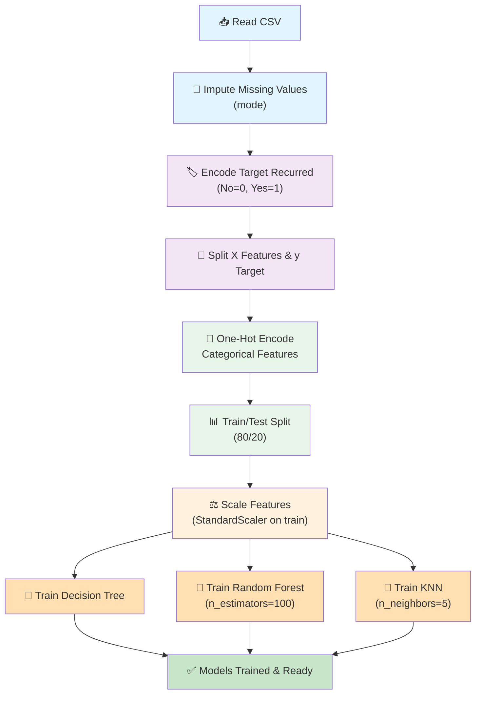
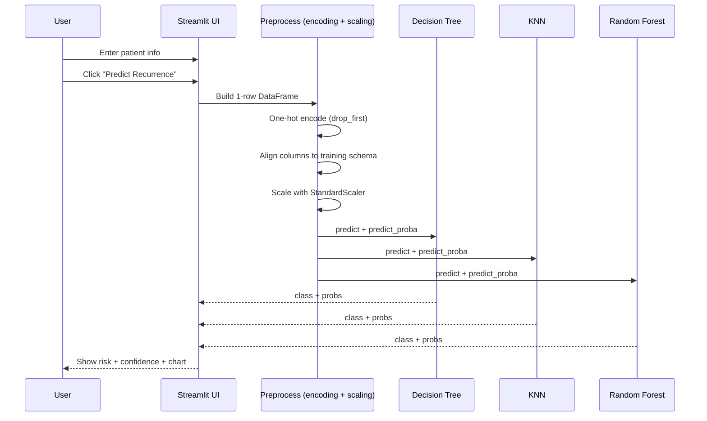

# Thyroid Recurrence Prediction — Project Explanation (Presentation Notes)

## 1) Elevator pitch (what this project does)
This project predicts whether a thyroid cancer patient will **recur** (target: `Recurred = Yes/No`) using basic clinical + pathology features. It trains and compares three classic ML classifiers:

- **Decision Tree**
- **Random Forest**
- **K-Nearest Neighbors (KNN)**

A **Streamlit** web app (`app.py`) provides a UI where a user enters patient attributes and gets predictions + probabilities.

---

## 2) Repo map (what each file/folder is for)

- `app.py` — Streamlit web application (loads data, trains models, renders UI, predicts).
- `Thyroid.ipynb` — Notebook used for EDA + preprocessing + training + evaluation plots.
- `data/filtered_thyroid_data.csv` — Dataset (383 rows, 13 columns) used for training.
- `Readme.md` — Short overview + metrics table.
- `docs/AI Project Documentation.pdf` — Supporting documentation.

---

## 3) High-level architecture (big picture)

### What runs where?
- **Frontend**: your browser shows the Streamlit UI.
- **Backend**: Streamlit Python process runs `app.py`.
- **ML layer**: scikit-learn trains models in-memory, then predicts.
- **Data layer**: CSV is read from disk each time the app starts (then cached).

**Key idea to say in a presentation:**
> The app is a single Python process that both *trains* and *serves* the models. Training is cached so the models are not retrained on every button click.

---

## 4) Dataset details (what features exist)
The CSV has 13 columns total: **12 inputs + 1 target**.

### Target
- `Recurred` (Yes/No) → converted to numeric with `LabelEncoder` (typically `No=0`, `Yes=1`).

### Inputs used as features (`X`)
- `Age` (numeric)
- `Gender` (F/M)
- `Hx Radiothreapy` (Yes/No)
- `Adenopathy` (Bilateral/Extensive/Left/No/Posterior/Right)
- `Pathology` (Follicular/Hurthel cell/Micropapillary/Papillary)
- `Focality` (Uni-Focal/Multi-Focal)
- `Risk` (Low/Intermediate/High)
- `T` (T1a/T1b/T2/T3a/T3b/T4a/T4b)
- `N` (N0/N1a/N1b)
- `M` (M0/M1)
- `Stage` (I/II/III/IVA/IVB)
- `Response` (Excellent/Biochemical Incomplete/Indeterminate/Structural Incomplete)

**Important:** the Streamlit UI must use exactly these names/levels because one-hot encoding depends on them.

---

## 5) ML pipeline (step-by-step, exactly what happens)
Both the notebook and `app.py` follow the same classic pipeline:

### Step A — Load the CSV
- `df = pd.read_csv('data/filtered_thyroid_data.csv')`

### Step B — Handle missing values
- For any column with missing values, fill with **mode** (most common value).

Why mode?
- Works for categorical data.
- Simple, fast, and matches what the notebook demonstrates.

### Step C — Encode the target `Recurred`
- Convert `Yes/No` to `1/0` using `LabelEncoder`.

### Step D — Split features vs target
- `X = df.drop('Recurred', axis=1)`
- `y = df['Recurred']`

### Step E — One-hot encode categorical columns
- Find categorical columns by dtype (`object`)
- Use `pd.get_dummies(..., drop_first=True)`

Why one-hot + `drop_first=True`?
- One-hot makes categories numeric.
- Dropping the first level avoids perfect multicollinearity (one column becomes the baseline).

### Step F — Train/test split
- `train_test_split(..., test_size=0.2, random_state=42)`

Why split?
- Train on 80%.
- Evaluate on unseen 20%.

### Step G — Scale features
- `StandardScaler()` is fit on train only, applied to train and test.

Why scaling?
- **KNN** is distance-based, so feature scale matters.
- Scaling also helps keep all features comparable.

### Step H — Train models
- Decision Tree: `DecisionTreeClassifier(random_state=42)`
- Random Forest: `RandomForestClassifier(n_estimators=100, random_state=42)`
- KNN: `KNeighborsClassifier(n_neighbors=5)`

---

## 6) Training flow diagram (pipeline view)

---

## 7) Streamlit app walkthrough (`app.py`) — what each part does

### 7.1 Page setup + styling
- `st.set_page_config(...)` sets title, icon, and layout.
- `st.markdown(<style>...)` injects CSS to make buttons/results look nicer.

### 7.2 `load_and_train_model()`
Decorated with `@st.cache_data`:
- Reads CSV
- Cleans missing values
- Encodes target
- One-hot encodes features
- Splits train/test
- Scales
- Trains DT + RF + KNN
- Returns models, scaler, feature column names, label encoder

**What caching means:**
- Streamlit stores the results of this function.
- On the next UI interaction, it reuses the trained models instead of retraining.

### 7.3 Input form
The UI collects each feature using:
- `st.number_input` for age
- `st.selectbox` for categorical variables

### 7.4 Prediction button behavior
When the user clicks **Predict Recurrence**:
1. Create a 1-row dataframe from the UI values.
2. One-hot encode it with `get_dummies(..., drop_first=True)`.
3. **Align columns** to training columns:
   - Add missing one-hot columns with 0.
   - Reorder columns to match training.
4. Scale the row with the same `StandardScaler`.
5. Run `predict()` and `predict_proba()` for each model.
6. Render:
   - Confidence metric
   - A "Recurrence / No recurrence" box
   - Bar chart for probability breakdown

---

## 8) Prediction flow diagram (runtime)

---

## 9) How to present the "model comparison" story
A clean talk-track:

- **Decision Tree**: simple, interpretable rules; often performs strongly on structured tabular data.
- **Random Forest**: ensemble of many trees → more robust, less overfitting, usually strong AUC.
- **KNN**: instance-based; performance depends heavily on scaling and K choice.

From `Readme.md`, the reported summary is:
- DT accuracy ~95.45% (high recall)
- RF slightly lower accuracy but very strong AUC
- KNN good accuracy and perfect precision in that run, but lower recall

---

## 10) How to run the project (demo steps)
From the repo root:

1) Install dependencies (minimal):
- `pip install streamlit pandas numpy scikit-learn`

2) Start the app:
- `streamlit run app.py`

---

## 11) Common presentation questions (with strong answers)

**Q: Why one-hot encoding?**
A: Models need numeric inputs; one-hot preserves categories without imposing fake order.

**Q: Why scaling?**
A: Especially required for KNN because it uses distances; scaling prevents one feature (like Age) from dominating.

**Q: What does `drop_first=True` do?**
A: It sets one category as a baseline to avoid redundant columns; prediction still works because baseline is represented by "all zeros" for that feature's dummy columns.

**Q: Is training inside the app production-ready?**
A: It's perfect for a demo/prototype. In production you'd typically train offline, version the model, and load a saved artifact.

---

## 12) If you want extra polish for slides
- Screenshot the Streamlit UI + results.
- Add the architecture diagram + pipeline diagram from this file.
- Mention that the pipeline avoids leakage by fitting the scaler on train only.
